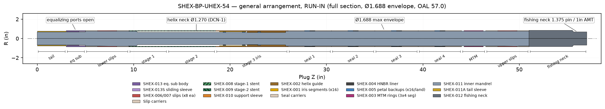
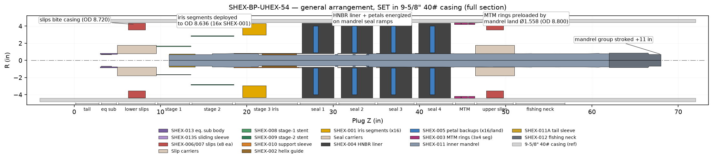
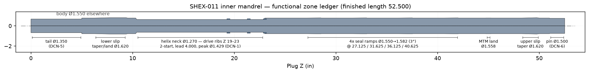
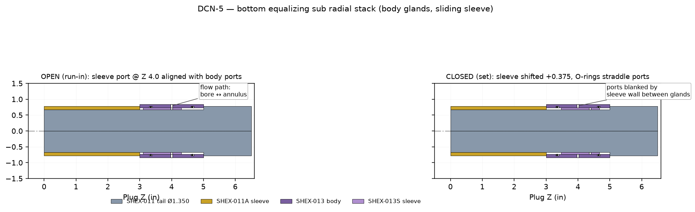
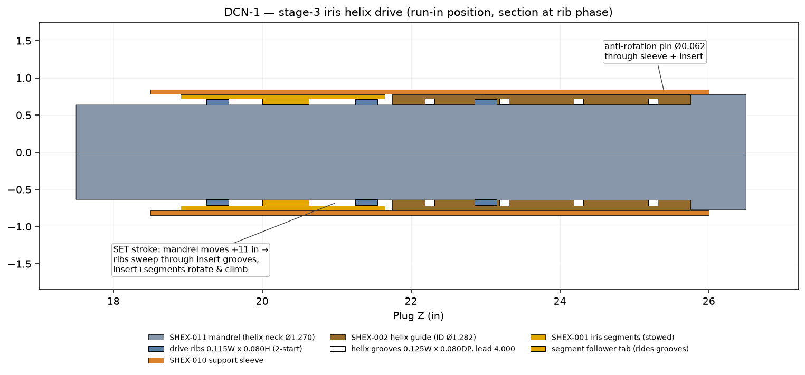
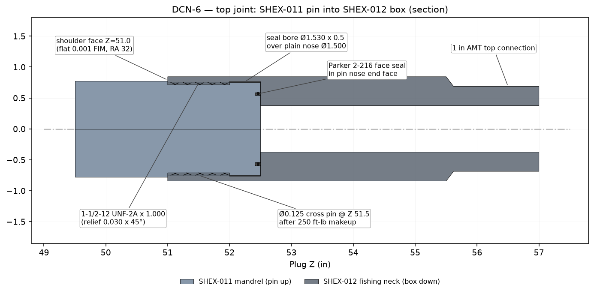
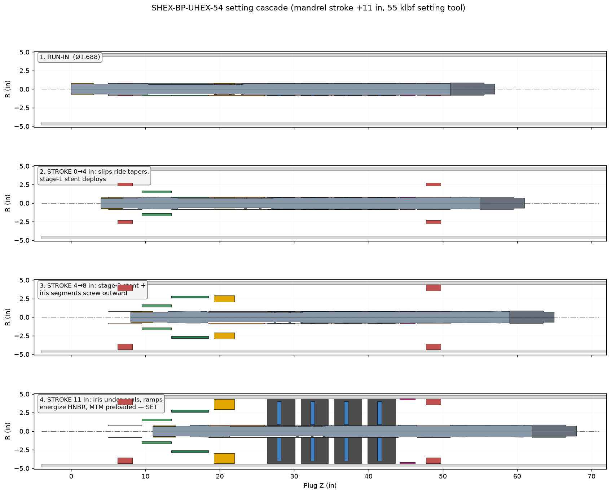
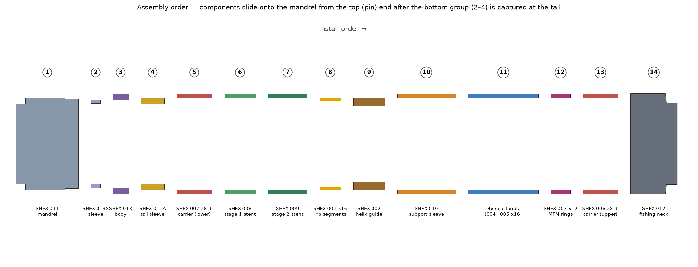

# SHEX-BP-UHEX-54 Ultra-High-Expansion Bridge Plug

## Engineering, Manufacturing & Assembly Manual

| | |
|---|---|
| Document | SHEX-MAN-001 Rev A |
| Tool | SHEX-BP-UHEX-54 thru-tubing retrievable bridge plug |
| Run-in OD / OAL | Ø1.688 in / 57.0 in (DCN-4) |
| Set casing | 9-5/8 in 40 lb/ft (ID 8.835, drift 8.679) |
| Rating target | 3,000–5,000 psi differential (FEA pending — §1.10) |
| Geometry authority | `cad/release_solids.py` → STEP files in `../step/` |
| Drawing set | 14 sheets in `../drawings/pdf/` (DXF in `../drawings/dxf/`) |

**Contents**

- [Part 1 — Engineering design](#part-1--engineering-design)
- [Part 2 — Manufacturing guide](#part-2--manufacturing-guide)
- [Part 3 — Assembly guide](#part-3--assembly-guide)
- [Appendix A — File index](#appendix-a--file-index)

---

# Part 1 — Engineering design

## 1.1 What this tool is

SHEX-BP-UHEX-54 is a thru-tubing bridge plug that runs at Ø1.688 in — small
enough to pass 2-3/8 in tubing — and sets in 9-5/8 in 40# casing, an
expansion ratio of **5.2 : 1** (8.835 / 1.688). No conventional plug
approaches this ratio; the design borrows the staged-expansion architecture
of vascular stents and catheter-deployed implants, scaled to oilfield loads
and re-implemented in machinable alloys.

The tool sets with a single axial stroke of the inner mandrel (+11.0 in,
≤55 klbf from the SHEX-ST-54 setting tool). Everything else — slips, stent
shells, iris segments, seal energization, metal-to-metal backup, equalizing
valve — is driven from that one stroke through cams, tapers and a helical
lead screw machined on the mandrel.

Run-in (collapsed) general arrangement:

Set (expanded) general arrangement in casing:

3D views of the released geometry: [run-in render](../png/SHEX-BP-UHEX-54_RUN-IN.png),
[set render](../png/SHEX-BP-UHEX-54_SET.png),
[set half-section](../png/SHEX-BP-UHEX-54_SET_section.png).

## 1.2 Module map

The plug is a stack of functional modules on a common mandrel. Plug Z is
measured from the bottom of the tool, increasing uphole.

| Plug Z (in) | Module | Key parts |
|---|---|---|
| 0.0 – 3.0 | Mandrel tail / bottom guide | SHEX-011 tail, SHEX-011A sleeve |
| 3.0 – 5.0 | Bottom equalizing sub | SHEX-013 body, SHEX-013S sleeve |
| 5.0 – 9.5 | Lower slips | 8× SHEX-007 + carrier |
| 9.5 – 13.5 | Stage-1 stent | SHEX-008 |
| 13.5 – 18.5 | Stage-2 stent | SHEX-009 |
| 18.5 – 26.0 | Stage-3 iris | SHEX-010 sleeve, SHEX-002 guide, 16× SHEX-001 |
| 26.0 – 44.0 | Seal lands ×4 (4.5 in each) | SHEX-004 liner + 16× SHEX-005 petals each |
| 44.0 – 46.5 | Upper MTM backup | 12× SHEX-003 (3 rings × 4) |
| 46.5 – 51.0 | Upper slips | 8× SHEX-006 + carrier |
| 51.0 – 57.0 | Fishing neck / top sub | SHEX-012 |

## 1.3 The mandrel is the machine

SHEX-011 is a solid 17-4 PH bar, finished length 52.500 in, that carries
every actuation feature as an OD step, taper, rib or land. There is no
through-bore — pressure integrity below the seals does not depend on an
internal plug.

Functional zones (bottom → top):

| Z (in) | Feature | Drives |
|---|---|---|
| 0 – 5.0 | Tail Ø1.350 (DCN-5) | Equalizing sleeve + bottom guide |
| 6.25 – 9.5 | Taper Ø1.550→1.620 + land | Lower slip expansion (12° incl) |
| 10.4 – 22.9 | Helix neck Ø1.270 (DCN-1) | Clearance for iris drive |
| 19.0 – 23.0 | 2-start drive ribs, lead 4.000, peak Ø1.429 | Iris rotation/expansion |
| 27.125 – 42.0 | 4× seal ramps Ø1.550→1.582 (3°) | HNBR seal energization |
| 44.75 – 45.25 | MTM land Ø1.558 | MTM ring preload |
| 48.25 – 50.0 | Taper Ø1.550→1.620 | Upper slip expansion |
| 51.0 – 52.5 | Shoulder + pin Ø1.500 (DCN-6) | Fishing neck joint |

## 1.4 Subsystem design

### 1.4.1 Bottom equalizing sub (SHEX-013 / SHEX-013S) — DCN-5

A ported body with an internal sliding sleeve. At run-in the sleeve ports
align with the body ports (Z 4.0) so the tool cannot piston while running.
During the first 0.375 in of setting stroke the departing mandrel tail
shoulder carries the sleeve up to its closed stop (anti-rotation lug Ø0.093
riding the sleeve slot), blanking the ports between the two body O-ring
glands. To retrieve, down-jarring re-opens the sleeve and equalizes across
the plug before the seals release.

DCN-5 rebuilt this stack from the spec (which was unbuildable — §1.8): seals
moved to **internal body glands** (2× -016 Viton 90, 0.045 in deep in the
Ø1.476 bore) riding the plain Ø1.470 sleeve OD.

### 1.4.2 Slips (SHEX-006 upper / SHEX-007 lower)

Eight segments per set, wire-EDM profile parts (deployed radii R3.560 →
R4.360, set OD 8.720), four OD tooth serrations, teeth case-hardened to
55 HRC min over a 28–32 HRC core. Each set rides a 12°-included expander
taper on the mandrel; tooth rake on the lower set is mirrored so the pair
brackets the plug against load from either direction. At run-in the
segments nest as collapsed arcs inside the Ø1.688 carrier envelope.

### 1.4.3 Stage-1 / stage-2 stents (SHEX-008 / SHEX-009)

Laser-cut sleeves on Ø1.688 × 0.063-wall tube — the direct stent analogue.
Staggered circumferential kerf slots (closed-cell at run-in) deploy to a
diamond mesh: stage 1 to Ø3.375, stage 2 to Ø5.750. They are radial
scaffolding for the cascade — each stage provides the reaction base for the
next — not pressure barriers. Deployment foreshortening ≈22 % is verified
on first article (§2). Flat-pattern DXF authority:
`export/stent/developed_dxf/` (kerf-compensated).

### 1.4.4 Stage-3 iris (SHEX-010 + SHEX-002 + 16× SHEX-001) — DCN-1

The signature mechanism. Sixteen rigid 17-4 segments (22.5° each, deployed
radii R2.955 → R4.318, set OD 8.636) ride in guide slots of the fixed
support sleeve. Each segment has a follower tab engaged in the 2-start
internal helical grooves of the Inconel 718 guide insert. As the mandrel
strokes, its 2-start drive ribs (lead 4.000) sweep through the insert
grooves, converting axial stroke into rotation-plus-radial travel — the
segments screw outward like an iris aperture opening, 1.363 in of radial
travel per segment over the 4.0 in active zone.

### 1.4.5 Seal lands ×4 (SHEX-004 + 16× SHEX-005)

Four identical 4.5 in lands. Each carries a molded HNBR 90A liner ring
backed by sixteen 17-4 anti-extrusion petals (deployed radii R0.895 →
R4.011). At full stroke the mandrel's four 3° seal ramps (Ø1.550→1.582)
arrive under the lands simultaneously and compress the deployed packs
against the casing wall (contact OD 8.720). The petals close the extrusion
gap behind the elastomer; four lands in series share the differential.

### 1.4.6 Upper MTM backup (12× SHEX-003)

Three rings of four 88° segments (joints staggered 30°), deployed radii
R4.200 → R4.400 (set OD 8.800 against casing ID 8.835). The mandrel's
Ø1.558 load land preloads the stack at end-of-stroke: a metal-to-metal
extrusion barrier above the elastomer seals for high-temperature /
high-differential holds.

### 1.4.7 Top joint (SHEX-011 ↔ SHEX-012) — DCN-6

Pin-up mandrel into box-down fishing neck: 1-1/2-12 UNF-2A × 1.000 thread
at the box mouth, plain Ø1.500 seal nose into a Ø1.530 seal bore, Parker
2-216 face seal in the pin nose end face, all shouldering at Z 51.0.
Cross-pinned Ø0.125 after 250 ft-lb makeup. Top connection 1 in AMT per
API 11BR for the setting-tool adapter and retrieval string.

## 1.5 Setting sequence

Stroke budget (total +11.0 in):

| Stroke (in) | Event |
|---|---|
| 0 – 0.375 | Mandrel tail carries equalizing sleeve to CLOSED stop |
| 0.375 – 4.0 | Slip tapers enter both slip sets; segments ride out and bite casing. Stage-1 stent deploys off its actuator |
| 4.0 – 8.0 | Stage-2 stent deploys; mandrel drive ribs traverse the helix insert — iris segments screw out to full radius |
| 8.0 – 11.0 | Four seal ramps arrive under the seal lands and energize the HNBR packs; MTM land Ø1.558 preloads the backup rings; setting tool shears off at release stud |

Set confirmation at surface: stroke counter = 11.0 ± 0.25 in and final
force ramp to ≥45 klbf without displacement.

## 1.6 Retrieval

1. Latch the Ø1.375 fishing neck with a standard 1.688-class GS pulling tool.
2. Jar down: mandrel strokes back, tail re-enters the equalizing sub and
   re-opens the sleeve — differential equalizes across the plug.
3. Continue down-stroke: seal ramps withdraw (HNBR relaxes), MTM preload
   releases, slip tapers withdraw (segments retract).
4. Straight pull retrieves the tool. The stents and iris do not fully
   re-collapse to Ø1.688; retrieval is to the next casing restriction above
   the setting depth only (not back through tubing). This is an accepted
   limitation of all ultra-high-expansion designs — see assumptions.

## 1.7 Materials summary

| Part | Material | Condition |
|---|---|---|
| SHEX-001/003/005/006/007/008/009/010/011 | 17-4 PH | H900 (H1150M where marked for toughness) |
| SHEX-002 helix guide | Inconel 718 | AMS 5662, aged |
| SHEX-004 liner | HNBR | 90 Shore A |
| SHEX-011A/012/013/013S | 4140 | HT 28–32 HRC (AMS 6415) |
| O-rings / face seal | Viton 90 | -016 ×2, 2-216 ×1 |

## 1.8 Engineering assumptions — read before relying on this design

These are every assumption of consequence baked into the released geometry,
grouped by how much risk they carry.

**A. Architecture-level assumptions (inherited from the original docs)**

1. **Stent extrapolation is valid at oilfield scale.** The cascade concept
   (each expansion stage scaffolds the next) is proven at millimetre scale
   in superelastic nitinol. Here it is implemented in 17-4 PH at 50× the
   size, where the material yields rather than recovering elastically. The
   design therefore relies on *plastic* expansion of the stent stages —
   they are formed in place and do not recover. Unvalidated by test.
2. **A 5.2:1 expansion ratio with a rigid-segment iris.** No industry
   precedent. The iris mechanism is kinematically sound (it is a lead screw)
   but the segment-to-casing load path at 8.6 in diameter from a 1.27 in
   mandrel is a long lever arm; segment tilt under differential is the
   first-order risk, reacted only by the support sleeve slot fit (0.120
   slot / 0.115 tab).
3. **Four elastomer lands in series share load equally.** In practice the
   uphole land takes most of the differential until it extrudes into its
   backup. The 4-land redundancy is treated as a series safety chain, not
   an equal load share.
4. **3,000–5,000 psi target.** `config/design_uhex_54in.yaml` retains a
   note that 0.125 segment thickness was "marginal at 5000 psi" in the FEA
   baseline and production thickness was raised to 0.187. No release-grade
   FEA exists for the as-released geometry (§1.10).

**B. Geometric reconciliations (the DCN log)**

The part specs contradicted each other in six places; the released geometry
resolves them as follows. Full detail in `../RELEASE_NOTES.md`.

| DCN | Problem in spec | Resolution in release |
|---|---|---|
| 1 | Helix grooves 0.080 deep in a wall of 0.001 | Mandrel necked Ø1.270 (Z 10.4–23.0), 2-start ribs peak Ø1.429; insert ID 1.552→1.282 |
| 2 | Tail sleeve OD 1.350 < ID 1.352 | OD 1.550 / ID 1.352 |
| 3 | Ø1.550 mandrel stub vs Ø0.750 neck bore | Finished length 52.500: shoulder Z 51.0 + Ø1.500 pin |
| 4 | OAL 54.0 vs 6.000 neck | OAL 57.0 in |
| 5 | Eq-sub sleeve OD 1.680 can't enter ID 1.562 body; grooves cut through every wall | Body 1.688/1.476 w/ internal glands; sleeve 1.470/1.354; tail Ø1.350 extended to Z 5.0 |
| 6 | Counterbore-at-mouth female cannot seal | Thread at mouth, seal bore deeper, face seal in pin nose |

**C. Run-in representation**

5. **Rigid profile parts cannot be "crimped" like stents.** The original
   docs say the iris segments, petals, slips and MTM segments are "nested
   and crimped to 1.688 OD" — impossible for rigid parts whose deployed
   radial width exceeds the run-in annulus (iris radial width 1.363 vs
   annulus 0.063). In the released run-in model these parts are shown as
   thin nested arcs *representing stowed position kinematics, not true part
   geometry*. The real tool requires either (a) segments machined as
   multi-leaf telescoping laminates, or (b) acceptance that deployed-profile
   parts ride *outside* a smaller-diameter core at run-in. **This is the
   single largest unresolved design question in the inherited concept.**
   The individual part STEPs and drawings are always true manufacturing
   geometry.
6. Stent slot patterns are modelled at 0.020 in display width; the
   manufacturing kerf is 0.008 (drawing + flat-pattern DXF authority).

**D. Quantitative assumptions**

7. Setting force ≤55 klbf, stroke 11.0 of the tool's 12.0 available.
8. Friction: lead-screw drive assumed self-locking in reverse under seal
   load (helix angle ≈ 40° on Ø1.35 pitch — *not* self-locking by
   classical criterion; the set position is actually held by the setting
   tool's body-lock ring, an assumption inherited from the setting tool
   spec, SHEX-ST-54).
9. Casing assumed 9-5/8 40# L80, nominal ID 8.835, no wear, no ovality.
   MTM set OD 8.800 leaves 0.035 diametral standoff (rings seat on
   pressure-assist, not interference).
10. HNBR 90A rated 150 °C continuous; tool is **not** an HPHT design.
11. Thread capacity: 1-1/2-12 UNF-2A engaged 1.000 in 17-4/4140 — shear
    area ≈ 2.4 in², far above the 55 klbf setting load (×10 margin); the
    Ø0.125 cross pin only locks rotation.
12. All module bores Ø1.562 over the Ø1.550 mandrel: 0.012 diametral
    running clearance, RA 32 travel zones — assumes verticality/no-debris
    during stroke; no debris barriers are designed in yet.

## 1.9 Verification status

| Check | Status |
|---|---|
| Geometric consistency (parts vs assembly, both states) | Done — model builds clean |
| STEP integrity (round-trip, 1 solid/part, no orphans) | Done — see `../RELEASE_NOTES.md` |
| Mass/volume sanity | Done (volume table in release notes) |
| Drawing completeness vs BOM | Done — 14 sheets cover all 15 parts |
| FEA (segments, petals, mandrel, thread) | **Not done** |
| First-article stent deployment test | **Not done** |
| Elastomer qualification (RGD, temperature) | **Not done** |

## 1.10 Open items

1. Release-grade FEA: iris segment bending at 5,000 psi; petal extrusion
   gap; mandrel column buckling at 55 klbf over the Ø1.270 neck (the
   governing section, A = 1.27 in², λ slender over 12.5 in unsupported).
2. Resolution of assumption C-5 (true run-in stowage of profile parts).
3. Setting-tool interface drawing (SHEX-ST-54 adapter, shear stud value).
4. Stage-1/-2 stent actuators (SHEX-014 bladder / SHEX-015 belleville
   wedge) are referenced by the stent drawings but not yet designed.
5. Debris barriers / wipers for the Ø1.562 travel bores.

---

# Part 2 — Manufacturing guide

## 2.1 General requirements (apply to every part)

- Dimensions in inches. Unless otherwise specified: .XX ±0.010,
  .XXX ±0.005, angles ±0.5°, break sharp edges 0.010 max.
- 17-4 PH parts: solution treat + age per drawing (H900 default; H1150M
  where the sheet says so). **Cut all features before aging** unless noted;
  passivate per AMS 2700 after final machining.
- 4140 parts: AMS 6415, quench & temper 28–32 HRC before finish machining.
- All sealing surfaces RA 16; mandrel travel zones RA 32.
- Certs: full material traceability; heat-treat charts; final inspection
  report against the drawing's critical dimensions (marked below).
- Every part gets its part number + heat lot laser-etched in a
  non-functional surface.

## 2.2 Per-part process routes

Drawing references are the authority for every dimension; this section
defines the *route* and the features that decide accept/reject.

### SHEX-001 iris segment — qty 16 — DWG-001-SHP

17-4 PH plate, 2.750 thick (H1150M).
1. Wire-EDM the deployed arc profile (R2.955 / R4.318 × 22.5°) — this is a
   profile part, **not** a turned OD.
2. Machine the follower tab (0.625 × 0.125 × 0.080 radial) on the inner
   face, mid-length. Tab width 0.125 ±0.003 is the **critical fit** to the
   SHEX-002 groove.
3. Root fillets R0.030 min; outer toe chamfer 0.025 × 45° both faces.
4. Age, passivate, electropolish exposed faces.
5. Inspect: tab width/position, arc radii (CMM), segment mass match within
   ±2 g across the set of 16 (balance).

### SHEX-002 helix guide insert — qty 1 — DWG-002A-SHP

Inconel 718 bar Ø1.75.
1. Turn OD 1.555 / bore Ø1.282 / L 4.000.
2. Cut the 2-start internal helical grooves 0.125 W × 0.080 DP, lead
   4.000 — sinker EDM with a helical electrode or 5-axis mill. Groove
   root Ø1.442. Start phases 180° apart; phase reference flat on the OD.
3. Age per AMS 5662.
4. Inspect: groove width gauge pin drag over full helix; phase between
   starts ±0.5°; functional test with mandrel + 1 segment in the SHEX-010
   pocket before acceptance.

### SHEX-003 MTM ring segment — qty 12 — DWG-005-SHP

17-4 PH plate, 0.750 thick. Wire-EDM 88° arc R4.200/R4.400. Age H900,
passivate. Inspect arc radii; segments are interchangeable — no serial
matching needed.

### SHEX-004 HNBR seal liner preform — qty 4 — DWG-007B-SHP

Compression-mold HNBR 90A ring Ø1.662/Ø1.562 × 0.550. Mold the **run-in
preform only** (the 8.720 set shape forms downhole). Parting line
mid-thickness, draft 1° min, flash ≤0.010, no mold release in the seal
zone. Post-cure per compound data sheet; durometer check 90 ±3 Shore A.

### SHEX-005 petal backup — qty 64 — DWG-007A-SHP

17-4 PH plate, 0.550 thick. Wire-EDM 22.5° sector R0.895/R4.011. Root
fillet R0.015 min, toe chamfer 0.015 × 45° both faces. Age, passivate.
Petals nest in sets of 16 — deburr thoroughly; any burr stacks 16×.

### SHEX-006 / SHEX-007 slip segments — qty 8 + 8 — DWG-008A/B-SHP

17-4 PH plate, 2.000 thick.
1. Wire-EDM the 41° sector profile R3.560/R4.360.
2. Mill the 4 OD tooth serrations (0.060 deep) **before** case hardening.
   SHEX-007 tooth rake is mirrored versus SHEX-006 — do not mix blanks.
3. Case harden teeth 55 HRC min, 0.020–0.030 case, core stays 28–32 HRC
   (induction or selective carburize with copper masking).
4. Inspect: tooth profile template, case depth coupon, bore face finish
   (rides the mandrel expander taper).

### SHEX-008 / SHEX-009 stent sleeves — qty 1 + 1 — DWG-009/011-SHP

17-4 PH tube Ø1.688 × 0.063 wall (or gun-drilled bar).
1. Laser-cut the slot pattern from the kerf-compensated flat-pattern DXF
   (`export/stent/developed_dxf/` is authority; kerf 0.008).
2. SHEX-008: 12 cells × 6 rings on L 4.000. SHEX-009: 14 cells × 4 rings
   on L 5.000.
3. Heat treat H900 **after** cutting; electropolish; zero burrs or recast
   slag (dye-pen the slot ends — crack initiation sites).
4. First article: deploy a sacrificial sleeve on the expansion die to set
   OD (3.375 / 5.750) and record foreshortening (expect ≈22 %); adjust
   pattern release only with engineering approval.

### SHEX-010 support sleeve — qty 1 — DWG-012-SHP

17-4 PH bar Ø1.75.
1. Turn OD 1.688 / bore Ø1.562 / L 7.500; helix pocket bore Ø1.558 over
   Z' 3.250–7.250; retaining-ring groove 0.030 × 0.040 at Z' 7.200.
2. Broach or wire-EDM the 16 internal guide slots 0.120 W × 0.055 DP ×
   2.750 L (slot centres Z' 2.375, indexed 22.5°). Slot width 0.120
   +0.003/-0.000 is the **critical fit** to the segment bodies.
3. Age H900, passivate. Deburr — no burrs in the helix pocket.
4. Inspect: slot index ±0.25°, pocket diameter (the SHEX-002 press/slip
   seat), bottom pilot Z' 0–0.750 (mates the stage-2 stent top).

### SHEX-011 inner mandrel — qty 1 — DWG-011B-SHP

17-4 PH bar Ø1.75 × 54 (solid — no through bore).
1. Rough turn the full OD ledger oversize 0.020; stress relieve.
2. Finish turn all zones per the ledger (§1.3 table): tail Ø1.350, body
   Ø1.550, slip tapers Ø1.620, helix neck Ø1.270, 4× seal ramps Ø1.582
   crest, MTM land Ø1.558, pin Ø1.500.
3. Mill/whirl the 2-start drive ribs Z 19–23 (round form 0.115 W ×
   0.080 H, lead 4.000, peak Ø1.429). Phase reference to the same flat
   used on SHEX-002.
4. Single-point the 1-1/2-12 UNF-2A × 1.000 thread; relief 0.030 × 45°.
   Face-groove the pin nose for the Parker 2-216 (OD 1.181 / ID 1.087 ×
   0.086 DP).
5. Age H900 (fixture vertically — straightness 0.005 per 12 in is the
   **critical spec**); finish-grind travel zones to RA 32.
6. Inspect: full ledger on CMM; rib lead and phase versus the SHEX-002
   functional gauge; straightness; thread gauge 2A.

### SHEX-011A tail sleeve — qty 1 — DWG-011A-SHP

4140 HT tube. Turn OD 1.550 / ID 1.352 × 3.000; chamfers 0.040/0.030 ×
45°. Slip fit over the Ø1.350 tail — verify by hand fit at assembly, no
shake.

### SHEX-012 fishing neck / top sub — qty 1 — DWG-010-SHP

4140 HT bar Ø1.75.
1. Turn body Ø1.688 × 4.5, pin section Ø1.375 × 1.5; through-bore Ø0.750.
2. Bore the female end per DCN-6: thread zone at the mouth (tap drill
   Ø1.4224, 1-1/2-12 UNF-2B × 1.000), then seal bore Ø1.530 × 0.500
   deeper, RA 16.
3. Cut the 1 in AMT top connection per API 11BR; gauge before ship.
4. Inspect: thread gauge 2B, seal bore finish/diameter, squareness of the
   bottom face to the thread axis 0.002 FIM (it is the joint shoulder).

### SHEX-013 equalizing sub body — qty 1 — DWG-013-SHP

4140 HT bar Ø1.75.
1. Turn OD 1.688 / bore Ø1.476 × 2.000.
2. Cut 2 internal gland grooves Ø1.566 × 0.098 W (0.045 deep) straddling
   the port plane per DCN-5.
3. Drill 4× Ø0.062 radial ports at Z' 1.000, 90° apart; deburr from the
   bore side (seal surface).
4. Drill the Ø0.093 × 0.250 DP anti-rotation pin seat at Z' 0.500.
5. 100 % pressure test all ports after machining.

### SHEX-013S sliding sleeve — qty 1 — DWG-013-SHP (view B)

4140 HT tube. Turn OD 1.470 / ID 1.354 × 1.200; drill 4× Ø0.062 ports at
Z' 0.900 matching the body pattern; mill the anti-rotation slot. OD is the
**dynamic seal surface** — RA 16, no scratches. Functional test in the
body: free travel 0.375 min without binding; flow open / blocked closed.

## 2.3 Bill of materials

| Item | Part | Qty | Material | Drawing |
|---|---|---|---|---|
| 1 | SHEX-011 inner mandrel | 1 | 17-4 PH H900 | DWG-011B-SHP |
| 2 | SHEX-013S sliding sleeve | 1 | 4140 HT | DWG-013-SHP |
| 3 | SHEX-013 equalizing sub body | 1 | 4140 HT | DWG-013-SHP |
| 4 | SHEX-011A tail sleeve | 1 | 4140 HT | DWG-011A-SHP |
| 5 | SHEX-007 lower slip segment | 8 | 17-4 PH, case teeth | DWG-008B-SHP |
| 6 | SHEX-008 stage-1 stent | 1 | 17-4 PH H900 | DWG-009-SHP |
| 7 | SHEX-009 stage-2 stent | 1 | 17-4 PH H900 | DWG-011-SHP |
| 8 | SHEX-001 iris segment | 16 | 17-4 PH H900 | DWG-001-SHP |
| 9 | SHEX-002 helix guide insert | 1 | Inconel 718 | DWG-002A-SHP |
| 10 | SHEX-010 support sleeve | 1 | 17-4 PH H900 | DWG-012-SHP |
| 11 | SHEX-004 HNBR liner | 4 | HNBR 90A | DWG-007B-SHP |
| 12 | SHEX-005 petal backup | 64 | 17-4 PH H900 | DWG-007A-SHP |
| 13 | SHEX-003 MTM ring segment | 12 | 17-4 PH H900 | DWG-005-SHP |
| 14 | SHEX-006 upper slip segment | 8 | 17-4 PH, case teeth | DWG-008A-SHP |
| 15 | SHEX-012 fishing neck | 1 | 4140 HT | DWG-010-SHP |
| 16 | O-ring -016 Viton 90 | 2 | FKM 90 | (seal kit) |
| 17 | Parker 2-216 Viton 90 | 1 | FKM 90 | (seal kit) |
| 18 | Cross pin Ø0.125 | 1 | 17-4 PH | (hardware kit) |
| 19 | Anti-rotation pins Ø0.062 / Ø0.093 | 1 + 1 | 17-4 PH | (hardware kit) |

---

# Part 3 — Assembly guide

Audience: shop service hand, bench assembly. Tool builds **horizontally on
V-blocks**, bottom (tail) to the left. Plug Z increases to the right.

## 3.1 Before you start

**Tooling:** V-block fixture rail ≥60 in; strap wrenches; thread compound
(API modified); Viton-safe O-ring lube; torque wrench to 300 ft-lb;
Ø0.125 / Ø0.093 / Ø0.062 drift pins and a 2 oz hammer; retaining-ring
pliers; segment nesting collet (SHEX-F-01 fixture); crimp die set
(SHEX-F-02); calipers + 0–2 in micrometer.

**Parts:** complete kit per BOM §2.3, every machined part with its
inspection report. Wash all parts; blow dry. **No dry assembly of seals.**

**Orientation rule:** every module slides on from the **pin (top) end** of
the mandrel and travels left (down-tool) to its Z station, except the
bottom group (steps 2–4) which loads from the tail end.

## 3.2 Build sequence

Numbers match the figure above.

**Step 1 — Mandrel on blocks.**
Set SHEX-011 in the V-blocks, tail (Ø1.350 end) left. Wipe travel zones;
verify no handling dings on the seal ramps (Z 27–42) — any raised metal
fails the build.

**Step 2 — Equalizing sleeve.**
Lube the SHEX-013S OD lightly. Slide it over the tail from the left, ports
facing up, to Z ≈ 3.1. It rides the Ø1.350 tail loosely until the body
captures it.

**Step 3 — Equalizing sub body.**
Fit the 2× -016 O-rings into the internal body glands (lube, do not roll
or twist). Slide SHEX-013 over the tail and over the sleeve to Z 3.0–5.0.
Install the Ø0.093 anti-rotation pin through the body seat into the sleeve
slot; stake. **Check:** sleeve shifts hand-force +0.375 and back without
binding; in the down (open) position the port stack is visually aligned
(flashlight through opposing ports).

**Step 4 — Tail sleeve.**
Slide SHEX-011A over the tail to Z 0–3.0, flush with the mandrel end at
Z 0. It backs the equalizing group from below.

**Step 5 — Lower slips.**
Position the lower slip carrier over Z 5.0–9.5. Nest the 8× SHEX-007
segments into the carrier windows **teeth up-hole** (rake holds from
below — the etched arrow on each segment points up-tool). Retain with the
carrier bands. Segments must sit below Ø1.688 — check with the ring gauge.

**Step 6 — Stage-1 stent.**
Slide SHEX-008 to Z 9.5–13.5, weld-seam datum line up. It pilots against
the slip carrier top face. No fasteners — axial capture comes from the
neighbouring modules.

**Step 7 — Stage-2 stent.**
Slide SHEX-009 to Z 13.5–18.5, datum up. Its top face is the pilot seat
for the support sleeve.

**Step 8 — Iris segments into the support sleeve (bench sub-assembly).**
On the bench, drop the 16× SHEX-001 segments into the SHEX-010 guide slots
using the nesting collet (SHEX-F-01), follower tabs inward. Hold with the
collet sleeve.

**Step 9 — Helix guide into the support sleeve.**
Press SHEX-002 into the sleeve pocket (Ø1.558 seat) until it lands at
Z' 3.250, **phase flat aligned to the sleeve witness mark** — the grooves
must pick up all 16 follower tabs; rotate the insert slowly while pressing
until every tab clicks in. Install the retaining ring at Z' 7.200, then the
Ø0.062 anti-rotation pin through sleeve + insert; stake.
**Check:** with the collet removed, rotating the insert by hand must walk
all 16 segments radially in and out together, no skipping.

**Step 10 — Iris module onto the mandrel.**
Slide the completed module over the pin end to Z 18.5–26.0. As the insert
reaches the drive-rib zone, rotate the whole module until the mandrel ribs
engage the insert grooves (witness mark on sleeve aligns with mandrel
phase flat at run-in). Seat against the stage-2 stent pilot.

**Step 11 — Seal lands ×4.**
For each land, lowest first (Z 26.0 / 30.5 / 35.0 / 39.5):
slide on the carrier; nest 16× SHEX-005 petals into the carrier window
(toe out-hole); seat the SHEX-004 HNBR liner above the petals (it grips the
carrier mechanically — no adhesive). Verify each pack sits under Ø1.688.
**Do not lube the HNBR OD.**

**Step 12 — MTM rings.**
Slide the 3 rings of 4× SHEX-003 segments into the Z 44.0–46.5 carrier
zone, **ring joints staggered 30°** ring-to-ring (witness dots align to
the 0/30/60 marks).

**Step 13 — Upper slips.**
As step 5 at Z 46.5–51.0 with 8× SHEX-006, **teeth down-hole** (mirror of
the lower set — etched arrow points down-tool).

**Step 14 — Fishing neck.**
Grease the 2-216 face seal into the mandrel pin nose groove. Dope the
1-1/2-12 UNF threads lightly. Make up SHEX-012 to the shoulder —
**250 ft-lb minimum** — then drill/ream the Ø0.125 cross-pin hole through
the pre-spotted location at Z 51.5, drive the pin, stake both ends.

## 3.3 Final checks (mandatory, record on the build sheet)

| # | Check | Accept |
|---|---|---|
| 1 | Ring-gauge full length | Ø1.688 gauge passes end to end |
| 2 | OAL | 57.00 ± 0.06 in |
| 3 | Equalizing valve | open at run-in position; hand-shift closes |
| 4 | Iris drive | rotating insert walks all 16 segments; returns free |
| 5 | Module stack | no axial shake > 0.015 total (feeler at fishing-neck shoulder) |
| 6 | Joint | cross pin staked; face seal not pinched (boroscope port) |
| 7 | Etch | tool S/N, date, build tech on fishing neck flat |

## 3.4 Run-in preparation note

Per assumption C-5 (§1.8), the profile-part packs (iris, petals, slips,
MTM) are **nested**, not crimped: final radial compaction to the running
gauge is done in the crimp die set (SHEX-F-02) which closes the carriers'
retaining bands — it does not plastically deform the segments. If any pack
springs over Ø1.688 after die release, the build fails and that module is
re-nested. The stent sleeves run as-machined (they are already at Ø1.688).

## 3.5 Torque & pin table

| Joint | Spec |
|---|---|
| SHEX-012 to mandrel pin | 250 ft-lb min, shoulder contact, then cross pin |
| Cross pin Ø0.125 | drive fit, stake 2 places |
| Anti-rotation pin Ø0.093 (eq sub) | press to 0.250 depth, stake |
| Anti-rotation pin Ø0.062 (helix) | press through sleeve + insert, stake |
| Setting-tool adapter (1 in AMT) | per setting-tool manual (SHEX-ST-54) |

---

# Appendix A — File index

| Content | Path |
|---|---|
| This manual | `export/release/manual/MANUAL.md` |
| Manual figures (source) | `export/release/manual/figures.py` |
| Part STEP files (15) | `export/release/step/parts/` |
| Assembly STEP run-in / set | `export/release/step/assemblies/` |
| Manufacturing drawings PDF/DXF | `export/release/drawings/` |
| DCN log + verification | `export/release/RELEASE_NOTES.md` |
| Machine-readable BOM | `export/release/manifest.json` |
| 3D preview renders | `export/release/png/` |
| Geometry source (authority) | `cad/release_solids.py`, `generate_release.py` |
| Stent flat patterns | `export/stent/developed_dxf/` |
| Legacy concept docs | `docs/DESIGN.md`, `export/drawings/part_specs/` |
