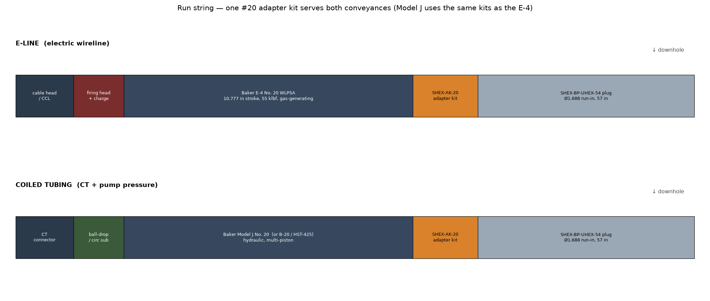
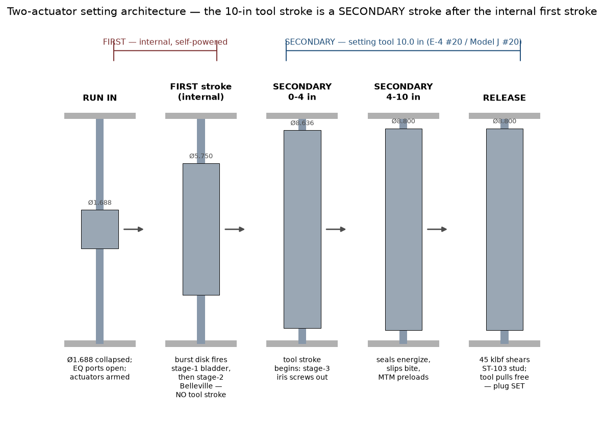
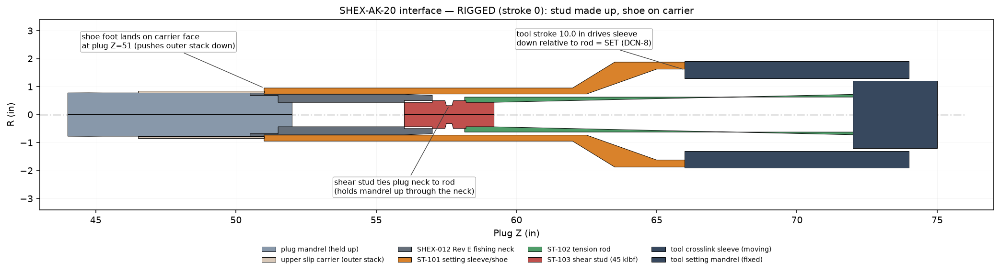
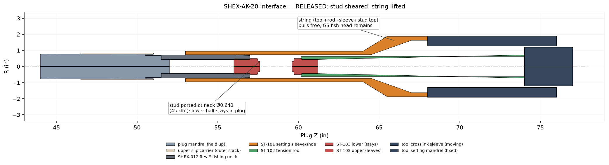
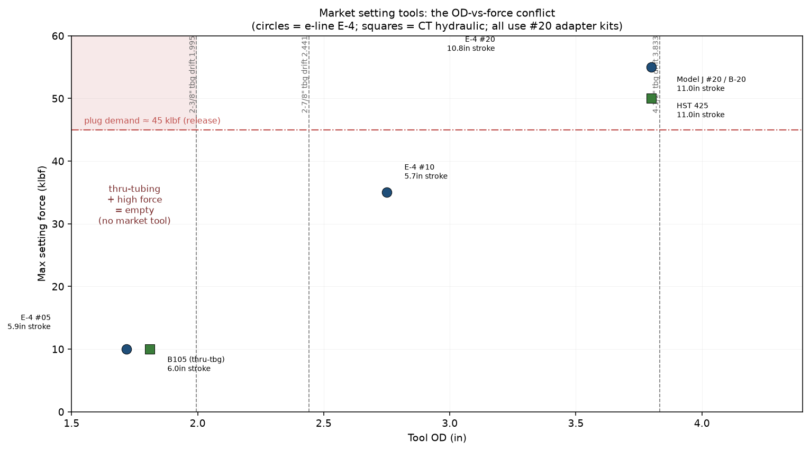
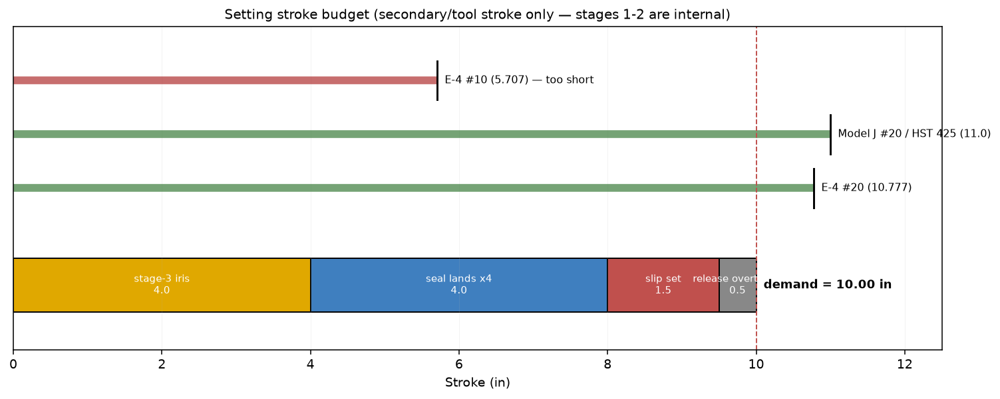

# SHEX-AK-20 Setting Adapter Kit

## Setting-Tool Engineering, Manufacturing & Operations Manual

| | |
|---|---|
| Document | SHEX-MAN-002 Rev A |
| Companion plug | SHEX-BP-UHEX-54 (see `MANUAL.md`) |
| Kit | SHEX-AK-20 adapter kit (ST-101…104) |
| Interface | Baker #20 (E-4 No. 20 e-line **and** Model J No. 20 CT) |
| Net set stroke | 10.0 in + 0.25 overtravel = 10.25 in demand (DCN-8) |
| Release | calibrated shear stud, 45 klbf ±5% (ST-DCN-2) |
| Geometry authority | `cad/setting_kit_solids.py` → `../step/parts/ST-*.stp` |
| Drawings | ST-DWG-101/102/103 in `../drawings/` |

**Contents**

- [Part 0 — Why an adapter kit, not a bespoke tool](#part-0--why-an-adapter-kit-not-a-bespoke-tool)
- [Part 1 — Engineering design](#part-1--engineering-design)
- [Part 2 — Market tool selection](#part-2--market-tool-selection)
- [Part 3 — Manufacturing guide](#part-3--manufacturing-guide)
- [Part 4 — Rig-up & operations guide](#part-4--rig-up--operations-guide)
- [Part 5 — Assumptions & open items](#part-5--assumptions--open-items)
- [Appendix A — File index](#appendix-a--file-index)

---

# Part 0 — Why an adapter kit, not a bespoke tool

The repo contains an earlier concept for a **bespoke electro-mechanical
setting tool** (`SHEX-ST-54`: 246 in, 3.625 OD, BLDC motor + ball screw,
12 in stroke, 55 klbf — see `First Pass Files/docs/SETTING_TOOL_DETAIL.md`).
That path is **parked**. A qualified downhole electro-mechanical setting tool
is a multi-year, multi-million-dollar program (motor, battery, telemetry,
20 ksi/350 °F packaging) and duplicates tools that already exist on every
service-company truck.

**This deliverable instead adapts the plug to standard, field-proven setting
tools** — exactly how every specialty plug reaches the market. The plug top
(DCN-7) and stroke budget (DCN-8) were already reshaped to a **Baker #20**
interface, and Baker confirms the **Model J** coiled-tubing hydraulic tool
"is the same size as the Model E-4 … and uses the same adaptor kits."
So **one kit (SHEX-AK-20) serves both e-line and coiled tubing.**

---

# Part 1 — Engineering design

## 1.1 The setting problem is split between two actuators

The plug is deliberately a **two-actuator machine**, and understanding this is
the key to the whole setting design. There are two distinct "strokes":

1. **First stroke — internal, self-powered.** The two stent stages expand
   *radially* from energy stored inside the plug: a burst-disk-fired HNBR
   bladder (stage 1, SHEX-014) and a Belleville stack (stage 2, SHEX-015).
   These are triggered by the arming/burst event — **not** by the setting
   tool. This is the "first stroke initiated somehow."
2. **Secondary stroke — the setting tool.** Only after the internal stages
   have opened the plug to Ø5.75 does the setting tool apply its single
   **axial 10.0 in stroke** to finish the job: stage-3 iris, four seal
   lands, and the dual slips, then shear free.

This split is what makes the plug settable at all. If the setting tool had to
do *all* the expansion (Ø1.688 → Ø8.8), the force and stroke would exceed any
market tool. By offloading the two big radial stages to internal actuators,
the tool only has to deliver the **residual** axial work.

> Important consequence: a **single-stroke** market tool (pyrotechnic E-4 or
> single-shot CT hydraulic) is sufficient, because the internal stages fire
> *before* the tool strokes. The tool does not need to "stroke, wait, stroke
> again." The sequencing happens between independent mechanisms.

## 1.2 How the adapter kit transmits the stroke

A setting tool produces **relative axial motion** between two members:
a **moving sleeve** (the crosslink/setting sleeve) and a **fixed mandrel**
(the setting mandrel/rod). The kit couples these to the plug:

- **ST-101 setting sleeve/shoe** threads onto the tool's moving sleeve and its
  foot lands on the plug's **upper slip carrier face** at plug Z = 51
  (the outer stack).
- **ST-102 tension rod** threads onto the tool's fixed mandrel and holds the
  plug **inner mandrel** through the fishing neck.
- **ST-103 shear stud** ties the rod to the plug fishing-neck box and sets the
  **release load** (45 klbf).
- **ST-104 spacers** tune the rig-up stand-off / stud preload.

When the tool strokes, the sleeve drives **down 10.0 in relative to the rod**.
Because the rod holds the mandrel up (through the neck) and the sleeve pushes
the outer stack down (through the carrier), the **outer stack displaces −10.0
in relative to the mandrel = SET**.

At the calibrated release load the stud parts at its neck; the string (tool +
rod + sleeve + upper stud half) lifts off, leaving the GS-profile fish head
(DCN-7) for later retrieval.

## 1.3 Kit dimensions (authority: `cad/setting_kit_solids.py`)

| Part | Key dimensions (in) | Material |
|---|---|---|
| ST-101 setting sleeve/shoe | L 15.000; shoe OD 1.900 / bore Ø1.470 × 11.0; cone to OD 3.750; box 3.250-8 UN × 2.0 | 4140 HT 28–32 HRC |
| ST-102 tension rod | L 15.100; body Ø1.250; bottom box 1.000-8 UN × 1.0; top pin 1.500-12 UNF × 1.25 | 4140 HT 28–32 HRC |
| ST-103 shear stud | L 3.200; bodies Ø1.000; **neck Ø0.640 × 0.200**; 1.000-8 UN pins both ends | 4140 HT 125–145 ksi lot |
| ST-104 stroke spacer | OD 1.900 / ID 1.480 × 0.250 (kit of 2) | 4140 HT |

Verified from STEP (re-imported): each part 1 solid, 0 orphan surfaces;
ST-101 L 15.000, ST-102 L 15.100, ST-103 L 3.200, ST-104 L 0.250.

## 1.4 Release-load design (ST-DCN-2)

The shear stud is the only calibrated element. Neck Ø0.640 in 4140 at
125–145 ksi UTS gives a shear-area parting load of **45 klbf ±5%**, set so the
tool releases *after* the plug is fully set but *below* the #20 tool's
55 klbf capacity (10 klbf margin) and below the rod tensile capacity
(min section 1.227 in², ~37 ksi nominal at 45 klbf). Lot calibration is
mandatory (Part 3).

---

# Part 2 — Market tool selection

## 2.1 Candidate tools (web-verified specs)

| Tool | Conveyance | Mechanism | Stroke (in) | Max force (lbf) | OD (in) | Interface |
|---|---|---|---|---|---|---|
| Baker E-4 #05 | e-line | gas/pyro | 5.879 | 10,000 | 1.718 | #05 |
| Baker E-4 #10 | e-line | gas/pyro | 5.707 | 35,000 | 2.750 (HD 3.800) | #10 |
| **Baker E-4 #20** | **e-line** | gas/pyro | **10.777** | **55,000** | 3.800 (HD 4.125) | **#20** |
| **Baker Model J #20** | **CT** | hydraulic | matches E-4 #20 | pressure × pistons | = E-4 #20 | **#20 (same kits)** |
| TechWest B20 / Renown B-20 | CT | hydraulic | ~10–11 | 50,000 (stud) | 3.8–4.25 | #20 |
| Pinnacle HST 425 | CT | hydraulic | 11 | pressure × pistons | Baker 20 conn | #20 |
| MAP MHSB / Fury HST | CT | hydraulic | model-dependent | pressure × pistons | #10 / #20 | #10/#20 |
| TechWest B105 / Renown B-10 | CT | hydraulic | ~6 | low (thru-tbg) | 1.81 | #10-class |

Sources: Baker Hughes E-4 technical unit; Owen MAN-SET-E410; RepeatPrecision;
Pinnacle, TechWest, MAP, Renown, Alpha product literature (logged in
`WORKING_LOG.md`).

## 2.2 The OD-versus-force conflict (the central finding)

The plug needs ~45 klbf and 10 in. Only the **#20** class delivers that — and
the #20 is **~3.8 in OD**. A 3.8 in tool **cannot pass through 2-3/8 or 2-7/8
production tubing**. The only tools slim enough to pass small tubing (E-4 #05
at 1.718 in, B105 at 1.81 in) top out near **10 klbf / 6 in** — far short.

There is **no market tool that is simultaneously thru-tubing-slim and
45-klbf-strong.** This drives the deployment decision:

- **SHEX-AK-20 (#20) — selected.** Deploy in **casing or large-bore tubing/
  liner (≥ ~4-1/2 in)** where a 3.8 in tool reaches setting depth. This is the
  realistic way to get 45 klbf with an off-the-shelf tool. The plug's Ø1.688
  run-in OD then buys ultra-high expansion ratio and minimal set-depth
  restriction, **not** literal small-tubing passage *with the tool attached*.
- **True small-tubing thru-tubing** (tool ≤ 1.9 in) would cap the setting
  force near 10 klbf, which is only feasible if the seal and slip systems are
  redesigned to be **pressure-energized** (set by applied wellbore/annulus
  pressure) rather than **stroke-energized**. Logged as an open redesign item
  (Part 5).

## 2.3 Stroke budget

With stages 1–2 internal, the tool stroke only feeds stage-3 + seals + slips:

| Function | Stroke (in) |
|---|---|
| Stage-3 iris deploy | 4.0 |
| Seal lands ×4 | 4.0 |
| Slip set | 1.5 |
| Release overtravel | 0.5 |
| **Demand** | **10.0** (DCN-8; +0.25 ≈ 10.25 with margin) |

E-4 #20 (10.777) and Model J #20 / HST 425 (≈11) both clear it. E-4 #10
(5.707) is **too short** — do not substitute down a size.

## 2.4 Recommended selections

| Conveyance | Primary tool | Alternates |
|---|---|---|
| Electric wireline | **Baker E-4 No. 20 WLPSA** (slow-set charge) | E-4 #20 HP/HT for >400 °F |
| Coiled tubing | **Baker Model J No. 20** | TechWest B20, Renown B-20, Pinnacle HST 425, MAP MHSB-20 (all #20, same kits) |

All share the #20 bottom interface, so the SHEX-AK-20 kit fits all of them —
**confirm the specific tool's crosslink-sleeve and setting-mandrel threads
against ST-DCN-3 before cutting a kit** (clone vendors vary).

---

# Part 3 — Manufacturing guide

## 3.1 General

- Dimensions in inches; tolerances per drawing. Unless noted: .XX ±0.010,
  .XXX ±0.005, angles ±0.5°, break edges 0.010 max.
- ST-101/102/104: 4140 AMS 6415, Q&T to **28–32 HRC** before finish machining.
- ST-103: 4140 from a **single calibrated heat lot, 125–145 ksi UTS**.
- MPI all parts after machining; no linear indications on load members.
- Etch part no + heat lot in a non-functional surface.

## 3.2 Per-part routes

### ST-101 setting sleeve/shoe — DWG-ST-DWG-101

1. Turn OD: shoe Ø1.900 × 11.0, cone to Ø3.750, top body Ø3.750.
2. Bore: shoe bore Ø1.470 +.005/−.000 × 11.5 (passes the Rev E neck body
   Ø1.450); 30° cone bore; 3.250-8 UN-2B box × 2.0.
3. **Shoe foot face**: square 0.002 FIM to the bore axis, RA 32 — it bears on
   the slip carrier annulus (Ø1.562–1.688) at plug Z = 51.
4. 4× milled wrench flats 0.75 W at the top OD.
5. **Critical**: the Ø1.900 × 11.0 shoe tube is a slender column at 45 klbf —
   no nicks/tool marks deeper than 0.005; check straightness.
6. MPI; verify box thread on the chosen tool's crosslink sleeve (ST-DCN-3).

### ST-102 tension rod — DWG-ST-DWG-102

1. Turn body Ø1.250; runout body-to-threads 0.003 FIM max.
2. Bottom box 1.000-8 UN-2B × 1.0 (takes the stud top pin); top pin
   1.500-12 UNF-2A × 1.25 (tool setting mandrel).
3. Wrench flats 2× 1.000 AF at mid-body. Radius all shoulders R0.06 min
   (fatigue — this is a full-tension member at 45 klbf, ~37 ksi nominal).
4. MPI.

### ST-103 calibrated shear stud + ST-104 spacer — DWG-ST-DWG-103

1. Machine stud: bodies Ø1.000, **neck Ø0.640 × 0.200**, 1.000-8 UN-2A pins
   both ends, 0.500 hex socket in the top end face. 45° neck shoulders,
   root R0.015 **max** (controlled break — do **not** polish, plate, or
   shot-peen the neck).
2. **Lot calibration (mandatory):** pull **3 studs per heat lot to failure**;
   accept the lot only if all 3 part within **42.75–47.25 klbf**. Stamp lot
   no + break load on both body flanks.
3. ST-104 spacer: OD 1.900 / ID 1.480 × 0.250, kit of 2.

## 3.3 Kit bill of materials

| Item | Part | Qty/kit | Material | Drawing |
|---|---|---|---|---|
| 1 | ST-101 setting sleeve/shoe | 1 | 4140 HT 28–32 HRC | ST-DWG-101 |
| 2 | ST-102 tension rod | 1 | 4140 HT 28–32 HRC | ST-DWG-102 |
| 3 | ST-103 shear stud | 1 (+spares) | 4140 HT 125–145 ksi lot | ST-DWG-103 |
| 4 | ST-104 stroke spacer | 2 | 4140 HT | ST-DWG-103 |
| 5 | Setting tool (E-4 #20 or Model J #20) | 1 | service-company asset | — |
| 6 | Plug GS pulling tool (retrieval) | 1 | 1.375 GS class | — |

---

# Part 4 — Rig-up & operations guide

Audience: wireline/CT crew at the rig. The plug ships **pre-assembled and
ring-gauged** (see plug `MANUAL.md` Part 3). This section covers connecting
the setting tool through the SHEX-AK-20 kit and running the set.

## 4.1 Pre-job checks

- Confirm the setting tool is a **#20** class with the expected crosslink-sleeve
  and setting-mandrel threads (matches ST-DCN-3, or re-cut the kit).
- Confirm the **shear stud lot certificate** (break load 42.75–47.25 klbf).
- Confirm casing/large-bore tubing ID at setting depth admits the **tool OD
  (~3.8 in)** all the way to depth — this kit is **not** for small-tubing
  passage with the tool attached (Part 2.2).
- Inspect the plug fishing neck (Rev E): GS profile, seal bore, top box.

## 4.2 Surface make-up (rig floor)

Make up bottom → top, hand-tight then torqued:

1. **ST-103 stud into the plug fishing-neck top box** (1.000-8 UN), hex-socket
   makeup. This is the calibrated release joint — do not over-torque.
2. **ST-102 rod onto the stud top pin**, then rod top pin into the **tool
   setting mandrel** box (1.500-12 UNF). The rod now holds the plug mandrel
   to the tool's fixed member.
3. Slide **ST-101 sleeve** over the plug fishing neck so its foot rests on the
   upper slip carrier face (plug Z = 51); thread its 3.250-8 UN box onto the
   **tool crosslink sleeve** (moving member).
4. Fit **0/1/2 ST-104 spacers** between the sleeve box face and the tool sleeve
   to take up stand-off so there is **no slack** in the load path at stroke 0.
5. Verify by hand: the kit is rigid, the shoe foot is square on the carrier,
   and the stud is the only tension tie between rod and plug.

For **e-line**: connect the firing head + CCL above the tool. For **CT**:
connect the CT connector + circulation/ball-drop sub above the tool.

## 4.3 Run in

- Convey tool + kit + plug as one string. Plug at Ø1.688; **equalizing sub
  ports OPEN** so the string does not piston.
- Correlate depth (CCL on e-line; depth counter / tag on CT).
- Do **not** apply set force during run-in.

## 4.4 Set sequence

| Step | e-line (E-4 #20) | coiled tubing (Model J #20) |
|---|---|---|
| 1 | At depth, hold tension; confirm position | At depth, tag/space out |
| 2 | **First stroke (internal):** arm/fire burst disk → stage-1 bladder, then stage-2 Belleville. Plug Ø1.688 → 5.75. **No tool action.** | same — internal, pressure/time triggered |
| 3 | **Secondary stroke:** fire E-4 power charge → single 10.0 in gas-driven stroke | **Secondary stroke:** drop/seat ball, pressure up CT → multi-piston 10.0 in stroke |
| 4 | Stroke drives stage-3 iris (0–4 in), then 4 seal lands + slips (4–10 in) | same |
| 5 | Load builds to **45 klbf → ST-103 stud shears**; tool releases | load builds to 45 klbf → stud shears; tool releases |
| 6 | Bleed off (E-4 disk bleeder) before POOH | CT ports open automatically; circulate/equalize |

**Set confirmation:** e-line — the power-charge stroke completes and tension
drops at release; CT — pump pressure spikes then drops at shear, tubing drains
on POOH. Pressure-test from above per program.

## 4.5 Release & retrieval

- After shear, the **string + upper stud half** pull free; the **lower stud
  half + GS fish head** remain on the plug.
- To retrieve the plug later: run a **1.375 GS pulling tool**, latch the fish
  head, jar **down** to re-open the equalizing sub and equalize, then straight
  pull (see plug `MANUAL.md` §1.6). Retrieval is to the next restriction above
  setting depth, not back through small tubing.

## 4.6 Torque & calibration table

| Joint | Spec |
|---|---|
| ST-103 stud → plug neck box | hand + defined makeup (do not exceed shear preload) |
| ST-102 rod → stud / tool mandrel | 1.500-12 UNF, standard makeup |
| ST-101 sleeve → tool crosslink sleeve | 3.250-8 UN, standard makeup + spacers |
| ST-103 release | 45 klbf ±5% (lot-calibrated, certificate required) |

---

# Part 5 — Assumptions & open items

## 5.1 Assumptions baked into this kit

1. **Deployment in casing / large bore.** The #20 tool OD (~3.8 in) reaches
   setting depth. The plug is **not** run through 2-3/8/2-7/8 tubing *with the
   #20 tool attached* (Part 2.2). If literal small-tubing thru-tubing is
   required, this kit does not apply.
2. **Internal stages 1–2 do the radial heavy lifting.** The 10 in / 45 klbf
   tool budget is only valid because the bladder (SHEX-014) and Belleville
   (SHEX-015) expand the plug to Ø5.75 first. Those actuators and their
   trigger/equalizing-sleeve interlock are **referenced but not yet designed.**
3. **45 klbf release is an estimate.** The true iris+seal+slip resistance is
   unverified (plug FEA open item). The stud neck is easily re-calibrated when
   FEA or first-article setting data exists.
4. **Tool-side threads (ST-DCN-3) are assumed** (3.250-8 UN crosslink sleeve,
   1.500-12 UNF setting mandrel). Confirm against the specific tool make/serial
   before cutting a kit; #20 clones vary.
5. **Single-shot set.** Both the E-4 (pyrotechnic) and a ball-drop CT tool set
   in one continuous stroke; there is no provision for a partial set / re-set
   in this kit.

## 5.2 Open items (carried in `FORWARD_PLAN.md`)

- Resolve the thru-tubing force conflict: either accept casing/large-bore
  deployment (current) or re-architect seals+slips as pressure-energized for a
  ≤1.9 in / ≤10 klbf thru-tubing tool.
- Setting-force FEA → finalize the 45 klbf release value.
- Design SHEX-014 bladder and SHEX-015 Belleville actuators and the
  equalizing-sleeve trigger interlock (the "first stroke").
- Verify ST-DCN-3 threads against the chosen tool; add a Schlumberger-interface
  variant if required.

---

# Appendix A — File index

| Content | Path |
|---|---|
| This manual | `export/release/manual/SETTING_TOOL_MANUAL.md` |
| Manual figures (source) | `export/release/manual/figures_setting.py` |
| Kit geometry (authority) | `cad/setting_kit_solids.py`, `generate_setting_kit.py` |
| Kit STEP parts | `export/release/step/parts/ST-101…104_*.stp` |
| Kit interface assemblies | `export/release/step/assemblies/SHEX-AK-20_INTERFACE_{RIGGED,RELEASED}.stp` |
| Kit drawings | `export/release/drawings/{dxf,pdf}/ST-DWG-101/102/103*` |
| Kit manifest | `export/release/manifest_setting_kit.json` |
| 3D previews | `export/release/png/SHEX-AK-20_*` |
| Working log / plan | `WORKING_LOG.md`, `FORWARD_PLAN.md` |
| Plug manual | `export/release/manual/MANUAL.md` |
| Setting sequence (legacy) | `First Pass Files/docs/SETTING_SEQUENCE.md` |
| Parked bespoke tool | `First Pass Files/docs/SETTING_TOOL_DETAIL.md` |
