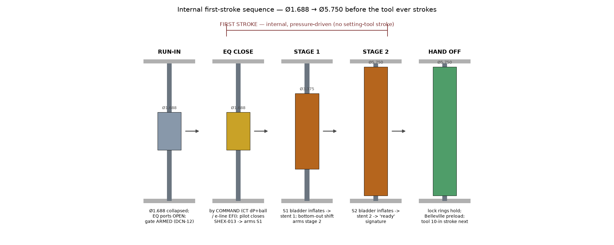
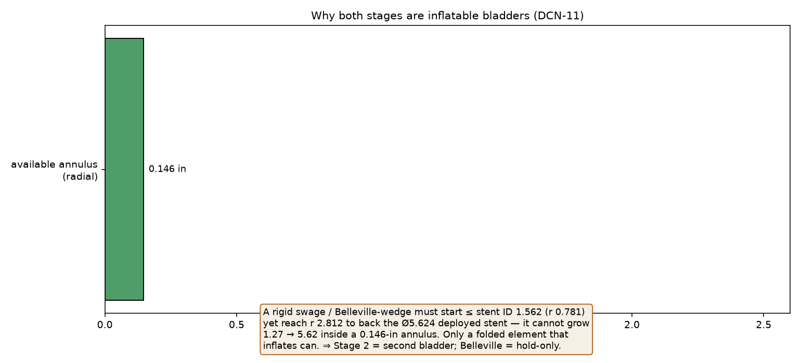
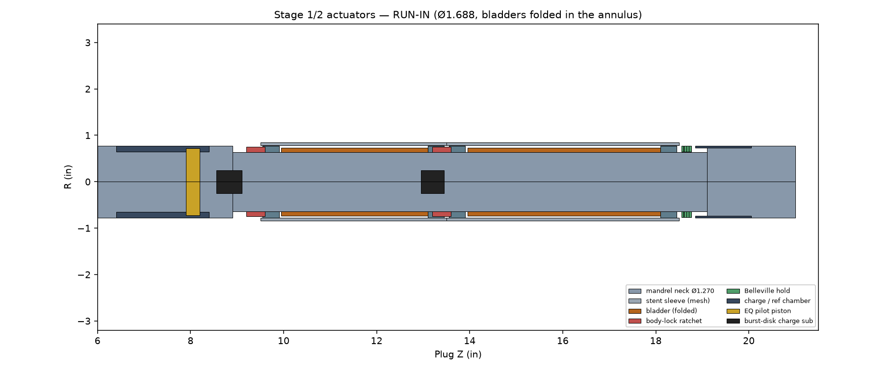
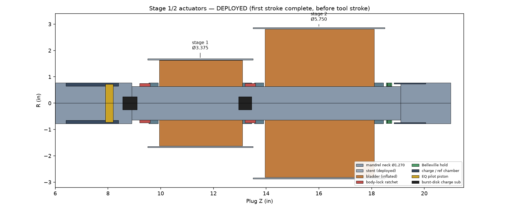
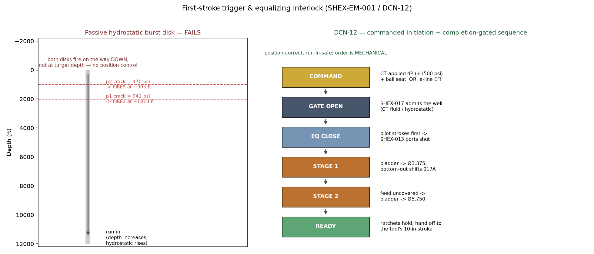
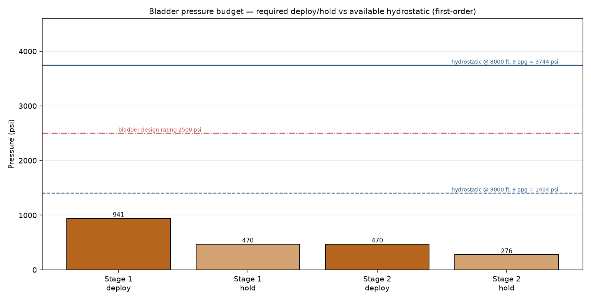

# SHEX-BP-UHEX-54 Stage 1/2 Internal Actuators

## Engineering, Manufacturing & Operations Manual

| | |
|---|---|
| Document | SHEX-MAN-003 **Rev B** |
| Scope | the internal "first stroke" — radial expansion Ø1.688 → Ø5.750 |
| Parts | SHEX-014 (stage-1 bladder), SHEX-015 (stage-2 bladder + hold), SHEX-016 (charge/EQ pilot), **SHEX-017 (sequence/initiation sub, DCN-12)** |
| Geometry authority | `cad/actuator_solids.py` → `../step/parts/SHEX-01*.stp` |
| Sizing authority | `export/analysis/actuator_design.py`, **`trigger_design.py`** (+ `.json`) |
| Drawings | ACT-DWG-014A/014B/014C/015/016/**017** in `../drawings/` |
| Companion docs | `MANUAL.md` (plug), `SETTING_TOOL_MANUAL.md` (kit), **`FIRST_STROKE_TRIGGER.md` (SHEX-EM-001)** |

> **Rev B (DCN-12).** The first-stroke **trigger and equalizing-sleeve
> interlock** are now engineered, not narrated. A passive hydrostatic burst
> disk has no position control (it fires during run-in — proven in
> `trigger_design.py` §1), so it is replaced by **commanded initiation +
> completion-gated sequencing** via the new **SHEX-017** sub. See the new
> [§1.4–1.6](#part-1--engineering-design) and [Part 5 DCN-12](#part-5--design-change-notices).

**Contents**

- [Part 0 — Where this fits](#part-0--where-this-fits)
- [Part 1 — Engineering design](#part-1--engineering-design)
- [Part 2 — Sizing & calculations](#part-2--sizing--calculations)
- [Part 3 — Manufacturing guide](#part-3--manufacturing-guide)
- [Part 4 — Assembly, arming & operation](#part-4--assembly-arming--operation)
- [Part 5 — Design Change Notices (DCN-10/11)](#part-5--design-change-notices)
- [Part 6 — Assumptions & open items](#part-6--assumptions--open-items)
- [Appendix A — File index](#appendix-a--file-index)

---

# Part 0 — Where this fits

The plug is a **two-actuator machine**. The setting-tool manual covers the
**secondary stroke** (the 10-in axial stroke from a Baker #20 tool that drives
stage-3 iris, seals and slips). This manual covers the **first stroke**: the
two internal radial expansions that open the plug from its Ø1.688 run-in
envelope to Ø5.750 **before the setting tool ever strokes.**

| | First stroke (this manual) | Secondary stroke (setting-tool manual) |
|---|---|---|
| Driver | internal, pressure-driven bladders | external setting tool, 10-in axial |
| Stages | 1 (→Ø3.375) and 2 (→Ø5.750) | 3 iris + 4 seals + slips |
| Energy | wellbore hydrostatic / applied CT pressure | gas charge (e-line) or CT pressure |

These actuators were referenced in the original concept (`SHEX-014` bladder,
`SHEX-015` Belleville) but never engineered or modelled. This release designs,
sizes, models and draws them — and corrects two inherited assumptions (DCN-10,
DCN-11).

---

# Part 1 — Engineering design

## 1.1 The annulus is the whole problem

Through the stage-1 (plug Z 9.5–13.5) and stage-2 (Z 13.5–18.5) zones the inner
mandrel is necked to **Ø1.270** (the DCN-1 helix neck). The laser-cut mesh
stent sleeves (SHEX-008/009) have **ID 1.562 / OD 1.688**. So the actuators
must live in a **0.146-in radial annulus** (0.292 diametral). Every design
choice flows from this.

## 1.2 Why both stages are inflatable bladders (DCN-11)

The original concept used a bladder for stage 1 and a **Belleville-driven
swage/wedge** for stage 2. That cannot work here:

- To back the mesh at its **final** Ø5.624 (under-stent), a rigid swage/cone
  must reach radius **2.812 in**.
- But at run-in every part must be **≤ stent ID 1.562** (radius 0.781).
- A rigid body starting at r 0.781 cannot grow to r 2.812 — and a Belleville
  stack that fits a 0.146-in annulus makes only ~250 lbf/washer, nowhere near
  the ~10–25 klbf radial demand.

Only an element that **folds small and inflates large** can span 1.27 → 5.62.

**Decision (DCN-11):** stage 2 is a **second inflatable bladder**, sequenced
after stage 1. The Belleville stack is retained **only** as a hold-open /
anti-recoil preload.

## 1.3 How a stage deploys

Each stage is a balloon-expandable mesh, scaled up from vascular-stent
practice:

1. A **reinforced HNBR bladder** (SHEX-014 / SHEX-015) sits folded in the
   annulus, sealed to the mandrel neck at both ends by **gland/swage rings**
   (SHEX-014A).
2. A **burst-disk charge sub** (SHEX-014C) admits a pressure source into the
   bladder bore.
3. The bladder inflates radially and plastically opens the laser-cut mesh
   stent to its deployed diameter.
4. A **body-lock ratchet ring** (SHEX-014B / 015D) walks up a mandrel ratchet
   band and **holds the stent open** after pressure bleeds off; the Belleville
   stack (SHEX-015B) maintains light axial preload against recoil.

## 1.4 Energy source — the well does the work

The bladders are **not** driven by a tiny self-contained chamber (which could
never store the ~1898 cc / energy in this annulus). They are driven by the
**well**, *gated* by the SHEX-017 sub:

- **Coiled tubing:** applied **pump pressure** down the CT — fully controlled,
  the preferred path.
- **Electric wireline:** **wellbore hydrostatic** pressure, admitted when an
  EFI gate is fired (§1.5). At 3000 ft / 9 ppg the hydrostatic is ~1400 psi; at
  8000 ft ~3744 psi — both exceed the deploy demand (Part 2). A small
  pyrotechnic gas generator is the documented boost for shallow/low-hydrostatic
  sets (hydrostatic < p1 ≈ 941 psi, i.e. below ~2000 ft).

## 1.5 Trigger & interlock — DCN-12 (this is what makes the first stroke *real*)

The inherited concept (a burst disk referenced to a sealed chamber, firing at
p1 < p2 with a 30 s orifice) **cannot work**: a disk referenced to absolute
hydrostatic fires at the depth where hydrostatic equals its crack pressure —
**on the way down, not at target depth.** There is no single pressure that both
survives run-in to a deep target and fires only at depth (proven in
`trigger_design.py` §1; full reasoning in **SHEX-EM-001**). So **DCN-12**
separates the three jobs that concept conflated:

| Job | DCN-12 solution |
|---|---|
| **Energy / volume** | the well (CT fluid or hydrostatic), gated by SHEX-017 |
| **Initiation** | a position-correct **command** — CT applied differential (+~1500 psi over annulus) + **ball seat**, or e-line **EFI gate** |
| **Sequencing** | **completion-gated** — each stent's bottom-out pressure climb shifts a shear-pinned arming sleeve that uncovers the next stage's feed |

**The SHEX-017 sequence / initiation sub** houses the gate, the ball seat /
reference piston (CT) and EFI port (e-line), the **stage1→2 arming sleeve**
(SHEX-017A), the metering orifice (plateau damping only) and the **feed
manifold** to both bladder lines.

## 1.6 Sequence (single command, mechanically ordered)

1. **Arm (surface):** ball out / EFI continuity OK; EQ ports OPEN; gate armed.
2. **Initiate (at depth, by COMMAND):** CT applied dP (+~1500 psi) **or** e-line
   EFI fire → opens the SHEX-017 gate to the manifold.
3. **EQ close:** the **pilot piston** (SHEX-016A) strokes **first** (lowest
   preload, shortest travel) → shifts the SHEX-013 sleeve **closed** → its
   end-of-stroke **uncovers the stage-1 feed**. EQ-before-S1 is now mechanical.
4. **Stage 1:** bladder 1 inflates → stent 1 → Ø3.375. At its **hard stop** the
   pressure climbs from the deploy plateau and **shears/​shifts SHEX-017A**,
   uncovering the stage-2 feed.
5. **Stage 2:** bladder 2 inflates → stent 2 → Ø5.750 → "ready" signature.
6. **Hand off:** body-lock ratchets hold both stages; the plug is at Ø5.750 and
   ready for the setting tool's secondary stroke.

Order is a **physical guarantee** — independent of depth, temperature and pump
rate — rather than a set of absolute pressure thresholds. No downhole
electronics are required beyond the e-line EFI initiator (which the E-4 setting
tool already carries).

---

# Part 2 — Sizing & calculations

First-order hand calcs (authority `actuator_design.py`). **Not** a substitute
for FEA + full-scale test (Part 6).

## 2.1 Expansion mechanics (ductile mesh, thin-wall hoop p = σ·t_eff/r)

| Stage | OD | ΔR/side | deploy p (worst case) | hold p | radial force at final OD |
|---|---|---|---|---|---|
| 1 | 1.688 → 3.375 | 0.844 | ~941 psi | ~470 psi | ~19,950 lbf |
| 2 | 3.375 → 5.750 | 1.188 | ~470 psi | ~276 psi | ~24,938 lbf |

σy = 30 ksi (annealed 316L, per DCN-10), ligament fraction 0.42, t 0.063.

## 2.2 Bladder sizing

| | Stage 1 | Stage 2 |
|---|---|---|
| Run-in (folded) OD | ~1.462 in | ~1.462 in |
| Deployed OD (to stent ID) | ~3.249 in | ~5.624 in |
| Inflation volume ΔV | ~26 in³ (433 cc) | ~116 in³ (1898 cc) |
| Deploy pressure | ~941 psi | ~470 psi |
| Design rating | 2500 psi (burst ≥ 3×) | 2500 psi |

## 2.3 Pressure budget vs available energy

The required deploy/hold pressures sit **below** both the bladder design rating
and the hydrostatic available even at 3000 ft — i.e., the well has ample energy
to deploy both stages. Stage 2 needs *less* pressure than stage 1 (larger
radius), which is convenient for the p1 < p2 sequencing.

## 2.4 Belleville hold stack

Annulus-limited washer (OD 1.540 / ID 1.290) ≈ 250 lbf each; **4 in series**
give ~200–300 lbf of anti-recoil preload over ~0.2 in — adequate as a *hold*,
confirming it cannot be the radial *driver*.

---

# Part 3 — Manufacturing guide

## 3.1 General

- Inch dimensions; tolerances per drawing (.XX ±0.010, .XXX ±0.005 unless noted).
- MPI all metal load parts after machining.
- Etch part no + heat/lot in a non-functional surface.

## 3.2 Per-part routes

| Part | Drawing | Material | Key features |
|---|---|---|---|
| SHEX-014 / 015 bladder | (elastomer spec) | HNBR + ply reinforcement | folded run-in OD ~1.46; deployed 3.25 / 5.62; 2500 psi rating, burst ≥3× |
| SHEX-014A gland / swage ring | ACT-DWG-014A | 17-4 PH H1075 | OD 1.550 / ID 1.270 × 0.350; OD crimp groove; bore concentric 0.002 FIM (4/plug) |
| SHEX-014B / 015D lock ring | ACT-DWG-014B | 17-4 PH H1075 | OD 1.500 / ID 1.270 × 0.400; 3 internal saw-teeth; 0.040 axial split; teeth harder than mandrel band |
| SHEX-014C / 015E charge sub | ACT-DWG-014C | 4140 HT + COTS burst disk | OD 0.500 × 0.550; disk counterbore 0.300; passage 0.125; stage-2 adds metering orifice |
| SHEX-015B Belleville | ACT-DWG-015 | Inconel 718 | OD 1.540 / ID 1.290; free height 0.100; stock 0.050; 4 in series |
| SHEX-015C Belleville housing | ACT-DWG-015 | 4140 HT | OD 1.550 / ID 1.290 × 1.200; counterbore 1.460 × 0.95 |
| SHEX-016 charge chamber | ACT-DWG-016 | 4140 HT | OD 1.550 / ID 1.300 × 2.000; 2 pilot ports 0.062 |
| SHEX-016A pilot piston | ACT-DWG-016 | 17-4 PH H1075 | seal land OD 1.450; stem 1.000; nose 0.700; 2 O-ring grooves |
| **SHEX-017 sequence sub** | ACT-DWG-017 | 4140 HT | OD 1.550 / bore 1.300 × 1.50; EFI/pilot port 0.200; 2× manifold feed 0.094; metering orifice 0.040; 2 ref-piston seal lands |
| **SHEX-017A arming sleeve** | ACT-DWG-017 | 17-4 PH H1075 | OD 1.290 / ID 1.050 × 0.60; feed port 0.094; 0.093 shear-pin hole (calibrated ~1720 psi) |
| **SHEX-017B reference piston** | ACT-DWG-017 | 17-4 PH H1075 | seal land OD 1.290; stem 1.000; Ø0.50 flow bore + tapered ball seat; 2 O-ring grooves |

## 3.3 Bladder fabrication notes

- Build like an inflatable-packer element: HNBR over a braided/woven ply
  carcass; ends vulcanised to steel inserts that the gland rings swage.
- Fold (not roll) at run-in so it opens evenly; protect during stent crimp.
- Proof each bladder to design rating; burst-sample per lot.

## 3.4 Stent material (DCN-10)

The stent sleeves SHEX-008/009 must be a **ductile, plastically-expandable
alloy** (annealed 316L or a Ni alloy) — **not** 17-4 PH H900, which is too
strong/brittle to hinge ~2× without cracking. Update the SHEX-008/009 shop
sheets accordingly.

---

# Part 4 — Assembly, arming & operation

## 4.1 Sub-assembly (shop)

1. Slip the **lower gland ring** (SHEX-014A) onto the mandrel neck at the stage
   datum; swage the **lower bladder end** into its crimp groove.
2. Fold the bladder over the neck; swage the **upper bladder end** into the
   **upper gland ring**; lock axially.
3. Install the **body-lock ratchet ring** below each stage over the mandrel
   ratchet band (one-way orientation — verify it walks the correct way).
4. Crimp the **laser-cut mesh stent** (SHEX-008/009) over the folded bladder to
   the Ø1.688 run-in envelope.
5. Stage 2 only: stack **4× Belleville** (SHEX-015B) in the **housing**
   (SHEX-015C), shim to preload, install above the stage.
6. Install the **SHEX-017 sequence sub** with its **reference piston**
   (SHEX-017B) and the **stage1→2 arming sleeve** (SHEX-017A, calibrated shear
   pin); land the **charge subs** (SHEX-014C/015E) as the manifold feed ports.
7. Install the **charge chamber** (SHEX-016) and **pilot piston** (SHEX-016A)
   below stage 1, tied to the SHEX-013 equalizing sleeve.

## 4.2 Arming (surface)

- **CT:** confirm the ball/dart and seat; pressure-test the gate below crack.
- **E-line:** install + continuity-check the **EFI initiator**; reference the
  SHEX-016 chamber (atmospheric or N₂ as specified).
- Confirm EQ ports OPEN; arming sleeve shear pin per spec; Belleville preload
  set. Record initiator lot / shear-pin calibration on the run ticket.

## 4.3 At depth — first stroke (DCN-12)

| Step | Coiled tubing | Electric wireline |
|---|---|---|
| Position | tag / space out | correlate CCL |
| **Initiate** | **drop ball, pump to hydrostatic + ~1500 psi** → opens gate | **fire EFI** → opens gate (hydrostatic then fills) |
| EQ close | gate pressure strokes pilot **first** → SHEX-013 closed → arms stage 1 | same (mechanical, gate-driven) |
| Stage 1 | bladder 1 → Ø3.375; **bottom-out shifts SHEX-017A** → arms stage 2 | same |
| Stage 2 | feed uncovered → bladder 2 → Ø5.750 | same |
| Confirm | pressure signature (gate / S1 plateau / S2 plateau) | time-tagged after fire; optional mandrel gauge |

Initiation is **position-correct** (you do it at depth, by command) and
**run-in-safe** (a ball-armed differential or an electrical signal — never bare
hydrostatic). Then proceed to the **secondary (tool) stroke** per
`SETTING_TOOL_MANUAL.md`.

## 4.4 Fail-safe states

| State reached | Plug condition | Recovery / next |
|---|---|---|
| Gate never opened | collapsed Ø1.688 | normal POOH — nothing fired |
| Gate open, EQ closed only | Ø1.688, ports shut | pull to re-open EQ via shift profile; fish on mandrel |
| Stage 1 only | Ø3.375, not anchored | recoverable on the mandrel; EQ re-opens on pull |
| Stages 1+2 complete | Ø5.750, locked open | proceed to the secondary (tool) stroke |
| Full set | Ø8.65 / seals / slips | tool shears free; plug holds |

## 4.5 Retrieval interaction

On retrieval the equalizing sub re-opens to balance pressure; the deployed
stents must collapse back onto the mandrel. A **shift-to-release profile** on
the mandrel (pulled by the fishing tool) is intended to release the one-way
body-lock rings — the detailed re-collapse kinematics remain an open item
(Part 6).

---

# Part 5 — Design Change Notices

- **DCN-10 — Stent material.** SHEX-008/009 re-specified from 17-4 PH H900 to a
  **ductile expandable alloy** (annealed 316L or Ni alloy). A balloon/pressure-
  expandable mesh must plastically hinge ~2×; H900 would crack. Affects the
  SHEX-008/009 shop sheets and any FEA material model.
- **DCN-11 — Stage-2 prime mover.** Changed from a Belleville/swage **wedge** to
  a **second inflatable bladder**. A rigid expander starting ≤ stent ID 1.562
  cannot grow to back the Ø5.624 deployed stent in a 0.146-in annulus
  (geometric impossibility), and an annulus-fit Belleville stack is ~2 orders
  of magnitude short on force. The Belleville stack is retained **only** as a
  hold-open / anti-recoil preload (SHEX-015B).
- **DCN-12 — First-stroke initiation & sequencing.** Replaced the passive
  hydrostatic-referenced burst-disk trigger (p1<p2 + time orifice), which has
  **no position control and fires during run-in** (proven, `trigger_design.py`
  §1), with a **commanded-initiation, completion-sequenced** architecture:
  (a) energy from the well; (b) initiation by **CT applied differential + ball
  seat** *or* **e-line EFI gate**; (c) **completion-gated** sequencing where each
  stent's bottom-out pressure shifts an arming sleeve that enables the next
  stage, with the **EQ pilot interlocked to close first**. Adds sub **SHEX-017**
  (+ 017A arming sleeve, 017B reference piston); re-tasks SHEX-013/014C/015E/016A;
  defines fail-safe states (§4.4). Full rationale: **SHEX-EM-001**
  (`export/analysis/FIRST_STROKE_TRIGGER.md`).

---

# Part 6 — Assumptions & open items

## 6.1 Assumptions

1. **The well supplies the deploy energy** (applied CT pressure or hydrostatic).
   Genuinely shallow/low-hydrostatic sets need the gas-generator option.
2. **First-order mechanics only.** Deploy/hold pressures and forces are thin-
   wall hoop estimates with an assumed ligament fraction — directional, not
   qualified.
3. **The mesh holds its own shape once expanded** (like a vascular stent); the
   lock ring + Belleville are anti-recoil backups, not primary structure.
4. **Completion-gated sequencing** (DCN-12) — the stent bottom-out pressure
   climb reliably shifts the SHEX-017A arming sleeve across temperature — is the
   key assumption to validate by test (replaces the old p1<p2+orifice assumption).

## 6.2 Open items (carried in `FORWARD_PLAN.md`)

- **FEA** of mesh plastic expansion per stage (pressure, strain, fatigue, and
  the post-expansion hoop stiffness that resists recoil).
- **Full-scale deploy test** of bladder + stent in a representative annulus,
  **including the DCN-12 completion-gating pressure signature**.
- **EFI / gas-generator selection + qualification** (e-line) and the
  **ball-seat / CT-pressure interface** to the specific Model J tool.
- **Arming-sleeve + shear-pin calibration** (SHEX-017A) across temperature;
  metering-orifice (plateau-damping) sizing.
- **Body-lock ratchet** load rating **and retrieval re-collapse kinematics**
  (shift-to-release profile, §4.5).
- Confirm the **mandrel charge-port, manifold drillings and ratchet-band**
  features get added to the SHEX-011 mandrel drawing (referenced, not yet cut).

---

# Appendix A — File index

| Content | Path |
|---|---|
| This manual | `export/release/manual/ACTUATOR_MANUAL.md` |
| **Trigger memo (DCN-12)** | `export/analysis/FIRST_STROKE_TRIGGER.md` (SHEX-EM-001) |
| Figures (source) | `export/release/manual/figures_actuators.py` |
| Engineering analysis | `export/analysis/actuator_design.py`, **`trigger_design.py`** (+ `.json`) |
| Geometry (authority) | `cad/actuator_solids.py`, `generate_actuators.py` |
| STEP parts | `export/release/step/parts/SHEX-014*/015*/016*/**017***.stp` |
| Sub-assemblies | `export/release/step/assemblies/SHEX-ACT-S12_{RUN_IN,DEPLOYED}.stp` |
| Drawings | `export/release/drawings/{dxf,pdf}/ACT-DWG-014A/014B/014C/015/016/**017***` |
| Full tool (Rev B) | `export/full_tool/` (regenerated with SHEX-017) |
| Manifest | `export/release/manifest_actuators.json` |
| 3D previews | `export/release/png/SHEX-ACT-S12_*` |
| Verify script | `export/release/verify_actuators.py` |
| Working log / plan | `WORKING_LOG.md`, `FORWARD_PLAN.md` |
